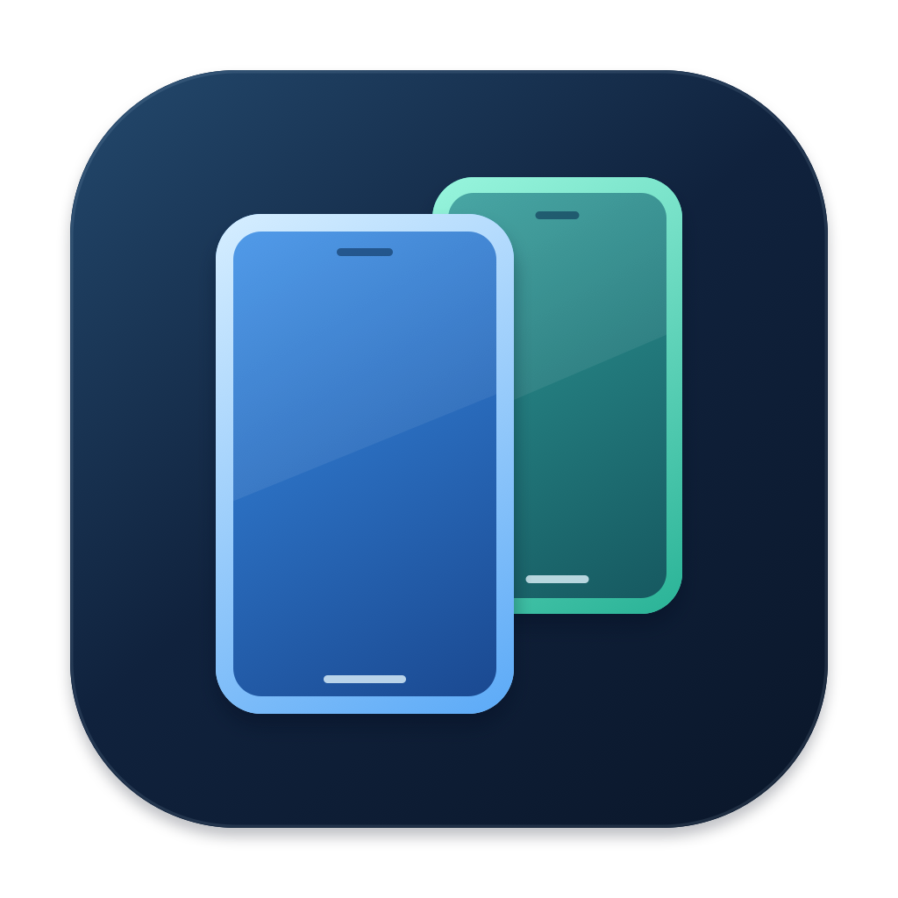

# Scrcpy Viewer



**Your Android displays, together in one Mac window.**

[中文说明](README.zh-CN.md) · [Install](docs/install.md) · [Releases](https://github.com/yiminspace/scrcpy-viewer/releases) · [Contributing](CONTRIBUTING.md)

Scrcpy Viewer is a native macOS client for the [scrcpy](https://github.com/Genymobile/scrcpy) Android server. Control your phone's main screen while automatically watching secondary displays appear, sleep, and disappear. No display IDs to look up and no collection of separate windows to manage.

## What it does

- Automatically discovers system-enumerated, capturable Android displays over adb.
- Shows the main screen and every active secondary screen edge to edge on one black canvas, with horizontal scrolling when needed.
- Supports mouse clicks, drags, scrolling, keyboard input, committed IME text, and `⌘A/C/X/V` on the main screen. Secondary displays are view-only.
- Keeps main-screen input focus when a new secondary screen appears.
- Removes sleeping or ended secondary screens from the live canvas and shows saved recordings in the sidebar with timestamps and thumbnails. Click a recording to open it in the system default video player.
- Saves the main screen and all active secondary screens together in one PNG, and reconnects to the selected device.
- Records the main screen and all active secondary screens together in a compact, silent MP4, including screens discovered during recording.
- Offers an optional automatic recording mode that follows secondary-display activity on the selected device.

Original scrcpy already captures a chosen secondary display. This client adds discovery, layout, and lifecycle management. Android determines which displays are available and capturable.

## Install

**Release downloads support Apple Silicon Macs running macOS 14 or later.** The interface is currently in Chinese. Intel, Windows, and Linux releases are not provided.

1. Download `Scrcpy-Viewer-<version>-macOS-arm64.zip` and `SHA256SUMS` from the same [release](https://github.com/yiminspace/scrcpy-viewer/releases).
2. Verify the download with `shasum -a 256 --check SHA256SUMS`, then unzip it.
3. Install adb with `brew install android-platform-tools` if needed. Run the included `bash setup-dependencies.sh` to install the pinned official scrcpy server; an existing compatible scrcpy 3.3.3 installation also works.
4. Move **Scrcpy Viewer.app** into `~/Applications` or `/Applications`, then open it. Enable USB debugging on your phone and authorize the Mac.

The app uses a free ad-hoc signature and is **not Apple-notarized**. macOS may block the first launch. For a download you trust, use **System Settings → Privacy & Security → Open Anyway**, as described in [Apple's instructions](https://support.apple.com/102445). See the included `INSTALL.md` or [full installation guide](docs/install.md) for details.

After installation, launch from Finder, Spotlight, or the Dock. From a terminal:

```bash
open "$HOME/Applications/Scrcpy Viewer.app"
```

## Screenshots and recording

The camera button saves the main screen and all active secondary screens in a single PNG. Screens outside the visible scroll area are included. Images sit edge to edge, without padding, gaps or title bars; any non-live frame carries its status and date inside that image.

Click the recording button in the toolbar, choose an MP4 destination, then stop when finished. Recording includes the main screen and all active secondary screens, independently of selection and scrolling. New active secondary screens join automatically; screens that sleep or disappear retain a dated last frame for that recording. Each session saves one MP4. Click the completion control at the bottom of the window to reveal it in Finder.

The silent H.264 output uses up to 720 pixels in height and 2560 pixels in width at 12 fps, with a bitrate adjusted to the output size, capped at 1.6 Mbps. Its fixed dimensions fit the widest combined layout seen during the session. Each layout keeps its proportions, fills the height and aligns to the left, with no gaps between screens or extra space above or below. Before a new screen appears, its future space on the right remains blank.

If a display appears or rotates, the app combines the changing layouts into the same final video after recording stops. This adds a saving step; a session with no layout changes does not need re-encoding. The history list shows only the completed video. If combining fails, the temporary source clips are kept for recovery. MP4 keeps video files compact; GIF export is not included. Switching devices or quitting finishes and saves the recording.

Automatic recording is off by default. Enable **副屏开启时自动录制** in the gear menu to start when the selected device has an active secondary display and a frame is available. Recording stops and saves after the last active secondary sleeps, disappears or disconnects. Multiple overlapping secondary displays share one recording session. A manual stop prevents restarting until all secondaries have closed; manually started recordings are not stopped by secondary-display activity. The setting persists across launches. Automatic files go to `~/Movies/Scrcpy Viewer`; the gear menu lets you change or open this folder.

The sidebar's recording history shows saved files with their time and a thumbnail. Click an entry to open it in the system default video player. History loads on launch and after saves from the selected recording folder and files explicitly saved by this app; it does not search other folders. Manually chosen save paths are remembered locally so those recordings remain available after relaunch.

## What is not included

Audio playback, file transfer, gamepad support, and creating new displays are **not implemented**. This is a focused multi-display client, not a complete replacement for scrcpy. For those features, use the original scrcpy client.

The Android device's encoder limits determine how many displays can stream simultaneously. Protected content or inaccessible virtual displays may not work. The app does not automatically wake the phone, inject input, or keep another app's background task alive.

## Build from source

Requires macOS 14+, Swift 5.10+ and Xcode Command Line Tools. XCTest requires full Xcode; CI runs the test suite on macOS.

```bash
git clone https://github.com/yiminspace/scrcpy-viewer.git
cd scrcpy-viewer
brew install android-platform-tools
bash scripts/setup-dependencies.sh
./scripts/run.sh
```

`./scripts/build-app.sh` creates `dist/Scrcpy Viewer.app`. `swift build` builds the executable; `swift test` runs the tests. `./scripts/package-release.sh` produces a verified ZIP and checksum file on Apple Silicon. Rebuild the original vector icon with `swift scripts/render-icon.swift`.

The server protocol is deliberately pinned to **3.3.3**. The setup script verifies the official server's SHA-256 and installs it in your Application Support directory without changing an existing scrcpy installation. The app never downloads dependencies on its own. See [dependency setup](docs/install.md#dependencies) and [architecture](docs/architecture.md).

## Releases and maintenance

CI checks pull requests. Validated changes on `main` drive versioning and release packaging; release artifacts are built from an exact version tag. See [the release guide](docs/releasing.md) for commit conventions, retries, and manual validation. Installing a newer release replaces the app; there is no in-app updater yet.

Please use [issues](https://github.com/yiminspace/scrcpy-viewer/issues) for reproducible bugs and feature requests. Include macOS, Android and app versions; remove device identifiers and personal screen content. Read [CONTRIBUTING.md](CONTRIBUTING.md) and [SECURITY.md](SECURITY.md) before sharing diagnostics.

## License and upstream

This independent project is licensed under [MIT](LICENSE). It is not an official Genymobile project. The upstream scrcpy server remains licensed under Apache-2.0; it is not committed to this repository or bundled into release downloads. See [third-party notices](THIRD_PARTY_NOTICES.md).
